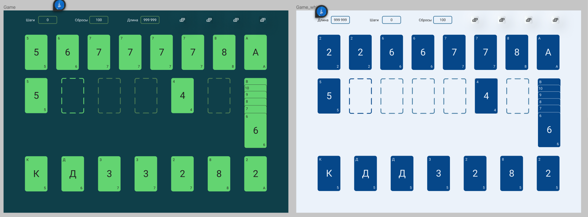
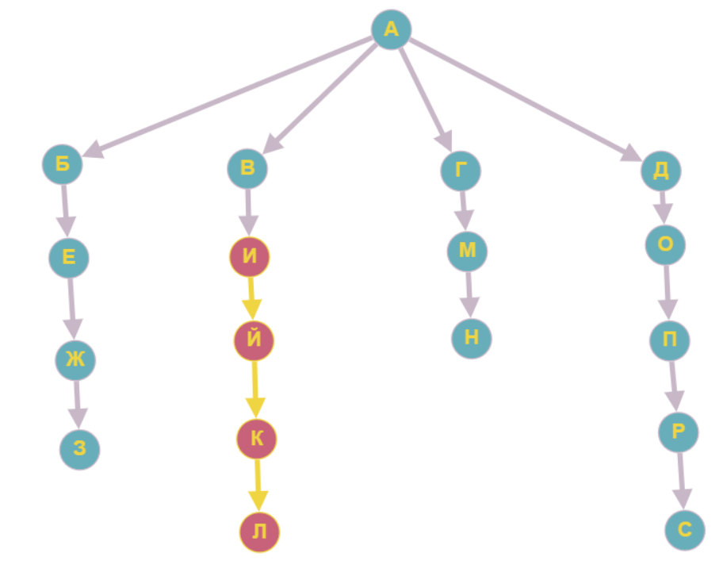
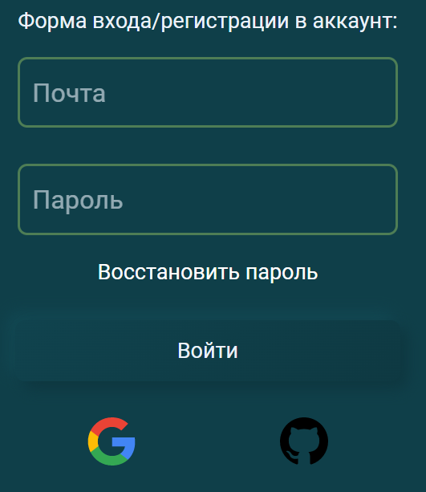
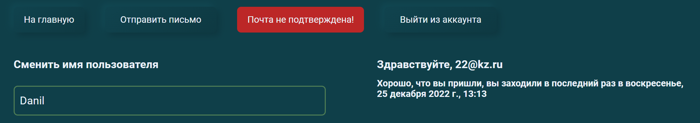
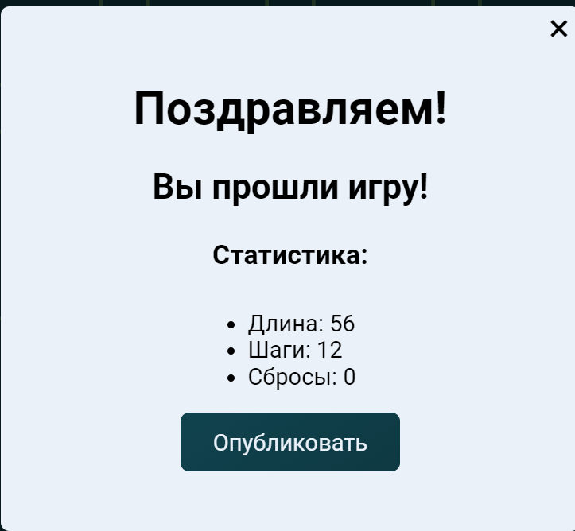
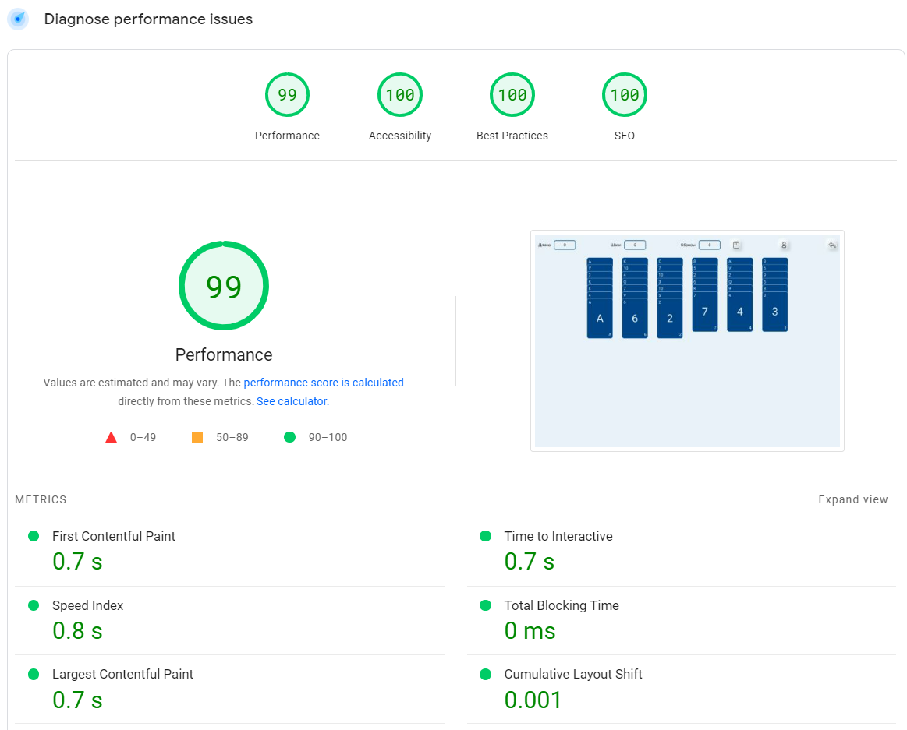

# Разработка модуля “Пасьянс” для конкурса “Конструируй, исследуй, оптимизируй”

В этой документации будет подробно рассказано о создании модуля, проблемах с которыми пришлось столкнуться, методах их решения и правила использования модуля.

# Оглавление

- [Формулировка Задания](#формулировка-задания)
- [Терминология](#терминология)
- [Разработка](#разработка)
  - [Выбранные инструменты и подходы](#выбранные-инструменты-и-подходы)
  - [Дизайн](#дизайн)
  - [Проблемы при разработке](#проблемы-при-разработке)
    - [Формулировка проблемы](#формулировка-проблемы)
    - [Решение](#решение)
- [Правила работы](#правила-работы)
  - [Доступные страницы](#доступные-страницы)
  - [Страница регистрации](#страница-регистрации-и-профиля)
  - [Страница конструктора](#страница-конструктора)
  - [Страница пасьянса](#cтраница-пасьянса)
  - [Страница рекордов](#страница-рекордов)
- [Итоги](#итоги)

## Формулировка задания

На экране случайно располагаются игральные карты из колоды в 36 карт (на узлах решетки 6х6). Перемещением карт по правилам пасьянса “Паук” (карту можно переместить только на карту со значением на 1 больше - короля на туза, даму на короля и т.д. 6 на 7 независимо от масти - если карты лежат подряд и одной масти, то переместить можно все эти карты разом.
Цель: сложить четыре стопки по мастям (стопки могут располагаться на любой позиции).
Критерии оценки решения:

1. главный критерий - суммарная длина перемещений (чем меньше, тем лучше);
1. второй критерий: - число перемещений (чем меньше, тем лучше) (можно попробовать поменять местами первый и второй критерии)
1. Число перемещений на свободные позиции (чем меньше, тем лучше)

Необходимо сделать, чтобы пасьянс сходился, поэтому нужно реализовать алгоритм “обратной раскладки”

## Терминология

Тут и далее я буду применять специализированные термины, связанные с *веб-разработкой*. В процессе повествования многие термины будут еще раз уточнены, а также привожу полный список слов, которые могут потребовать пояснений.

- TypeScript — Язык программирования, транслируемый в JavaScript. Является усовершенствованной версией JavaScript со слабой статической типизацией.
- React — Библиотека для JavaScript для построения пользовательских интерфейсов в декларативном стиле.
- Декларативный стиль — Стиль программирования (противоположность императивному), в котором программистом описывается не пошаговый способ получения результата, а лишь цель (Не как нужно, а что нужно). Пример декларативных языков: SQL, CSS.
- Компонент — Обособленная часть кода, которая может встраиваться в другие компоненты и отображается на странице. Часть конструктора, из которого собирается страница.

## Разработка

### Выбранные инструменты и подходы

Для разработки мы будем использовать язык TypeScript и библиотеку React для построения интерфейса. Полный список зависимостей можно посмотреть в файле [конфигурации](https://github.com/kyzinatra/spider-solitaire/blob/master/package.json). В качестве баз данных возьмем FireBase - NoSQL решение, которое хорошо подходит для наших задач в силу своей гибкости и низкого порога входа.

Весь модуль будет представлять собой несколько страниц, которые будут иметь доступ к компонентам друг к друга. Это значит, что части с одной страницы легко переиспользуются на другой. Это позволит перенести готовую систему перемещения карт в конструктор и сохранить принцип DRY в коде. В остальном будем придерживаться функциональной парадигмы программирования и декларативного подхода.

### Дизайн

Для подготовки создания модуля необходимо нарисовать дизайн. Делать это будет в программе figma и нарисуем 2 макета, которые в последствии станут светлой и темной темой для нашего сайта. Посмотреть дизайн [можно тут](https://www.figma.com/file/KtrS8HtCKMWUbTAf07USE1/Untitled?node-id=0%3A1&t=vBB502PYNaOkNyrs-1). Так же макет обсуждался согласовывался отдельно с дизайнером.



### Проблемы при разработке

При проектировании системы перетаскивания карт были проблемы с обработкой коллизий 2 контейнеров и анимацией карт после того, как пользователь отпускал кнопку мыши. Решение этой проблемы, также помогло разобраться с проблемой отображения и хранения карт.

#### Формулировка проблемы

Необходимо эффективно обрабатывать коллизии и анимации. Технически невозможно изменять положение каждой отдельной карты. Это слишком затратно по ресурсам. При этом необходимо сохранить гибкость и легкость кода.

При перемещении нескольких карт, или нажатии на них. Они все вместе должны подсвечиваться, а при перемещении одной стопки на другую должен подсвечиваться контейнер куда попадет карта. По ресурсам и структуре кода очень накладно сообщать каждой отдельной карте ее состояние (которых довольно много). Это порождает много костылей и багов в работе. К тому же нам совсем не нужно управлять каждой картой в отдельности, ведь если подсвечивается карта `X`, то должны подсветиться и все карты ниже `X`.

#### Решение

Для решения этой проблемы воспользуемся довольно нетипичным приемом в React. Мы будем создавать компонент карты внутри компонента карты. Рекурсия может быть довольно опасной в данных условиях, поскольку все эти данные будут создаваться и в реальном времени обновляться на экране пользователя

```js
// Компонент Карты

function Card(isFocusUp, cards) {
  // На этом моменте мы получаем пользовательский фокус по этой конкретной карте
  // С помощью браузерных событий.
  const isCardInFoucs = useCardFocus();

  // Создаем интерфейс
  return (
    // [1]
    <div>
      <div>
        <span>{cards[0].title}</span> // Показываем карту
      </div>
      // Если нам есть, что рендерить ниже, то мы прокидываем состояние фокуса вниз и снова запускаем функцию Card
      {cards.length > 1 && <Card isUpFocus={isCardInFoucs} cards={cards.slice(1)} />}
    </div>
  );
}
```

Таким образом взяв выбранную карту `X` Мы всегда сможем получить всех ее потомков. Более того, получается, что у всех карт вниз по дереву есть общий контейнер `[1]`. Если нам понадобится переместить блок карт, то мы перемещаем только `[1]`, а остальные карты будут перемещаться вместе с ним, так как они его потомки. Если нам понадобится подсветить блок карт, то мы должны поменять состояние только переменной `isCardInFoucs` в карте на которую произошел клик. Далее вниз по дереву передается это состояние просто вследствие выбранного способа их представления. Мы для этого ничего не делаем.



Получается вот такой граф. На нем видно как фокус, который был вызван на вершине `И`. Вниз по дереву распространяется до вершины `Л`. Таким образом перемещение карт связано с перемещением части дерева на другой лист. Для представления дерева в коде будем использовать связный список и нескольких позиций на которых могут быть размещены наши карты. На картинке их 4. А внутри будем использовать массив из узлов карт. Мы храним не сами компоненты, которые были описаны выше, а лишь информацию о том, как они должны выглядеть (Заголовок карты и уникальный ключ), а расположение на экране задается местом в нашей структуре данных.

## Правила работы

### Доступные страницы

При заходе на сайт для вас предложена базовая раскладка карт, которую уже можно складывать. Доступна кнопка отмены действия.


А также иконка правил и профиля. Чтобы получить доступ ко всем функциям сайта необходимо зарегистрироваться. Для этого необходимо нажать на иконку с профилем и откроется окно регистрации\входа в существующий аккаунт. После входа станет доступным страницы с конструктором а также возможность смотреть чужие рекорды, а также побеждать их.

### Страница регистрации и профиля

При клике на иконку профиля на главной странице открывается страница регистрации. Тут можно либо войти в существующий аккаунт, либо создать новый с помощью почты и пароля. Также доступен вход с помощью `google` и `github`.



После входа по той же иконке станет доступна страница профиля. На ней можно сменить отображаемое имя, отправить сообщение на почту с ее подтверждением и выйти из аккаунта.



### Страница конструктора

Страница конструктора представляет собой панель с доступными картами и несколько кнопок.

1. Играть — сохраняет текущее состояние конструктора и перенаправляет пользователя на главную страницу для прохождения пасьянса
1. Генерировать — с помощью алгоритма обратной раскладки расставляет случайным образом карты на доступные клетки в конструкторе. Отметим, что раскладки сгенерированные с помощью этого алгоритма всегда можно сложить.
1. Новая карта — добавляет доступное поле для того, чтобы класть туда карты.
1. Удалить карту — удаляет доступное поле для того, чтобы класть туда карты.

С помощью панели карт справа мы можем добавлять любые карты на наше усмотрение на доступные поля просто перетаскивая карты.

### Страница пасьянса

Это главная страница проекта. Тут вы можете собирать пасьянс. Карты на этой странице могут быть присланы из конструктора или из страницы с рекордами. Перемещение карт по правилам пасьянса “Паук” (карту можно переместить только на карту со значением на 1 больше - короля на туза, даму на короля и т.д. 6 на 7 - если карты лежат подряд и одной масти, то переместить можно все эти карты разом.
Цель: сложить несколько стопок (стопки исчезают после того, как полностью собраны).

После успешного завершения игры появляется окно со статистикой игры (ее также можно отслеживать на верхней панели в процессе игры).



Если перед сборкой вы вошли в аккаунт то вы можете опубликовать ваш результат, который будет помещен в таблицу результатов в порядке возрастания рядом с вашим соперником, или, если вы создавали свою карту, ваш результат будет добавлен в таблицу и другие пользователи смогут с вами соревноваться на конкретно этой карте.

### Страница рекордов

Данная страница доступна только зарегистрированным пользователям и позволяет запускать карты других игроков и соревноваться с ними в лучшем результате по 3 характеристиками:

1. Главный критерий - суммарная длина перемещений (чем меньше, тем лучше)
1. Второй критерий - число перемещений (чем меньше, тем лучше)
1. Третий критерий - Число перемещений на свободные позиции (чем меньше, тем лучше)

Нажав на кнопку играть вы сможете открыть карту и попробовать ее собрать. После вам снова откроется окно с результатом и предложит вам его опубликовать. Таким образом вы можете соревноваться с другими людьми и своими друзьями.

## Итоги

В данном проекте мы разработали многопользовательскую игру по собственным правилам, основанную на игре Пасьянс. Мы смогли создать отзывчивый и быстрый интерфейс. Хоть мы и использовали довольно много тяжеловесных технологий и ресурсов мы смогли разработать быстрый и легкий сайт и код, который показывает отличные результаты в тестах



Также с помощью технологий google (reCAPTCHA V3.0 и Google appcheck) была обеспечена безопасность приложения.
